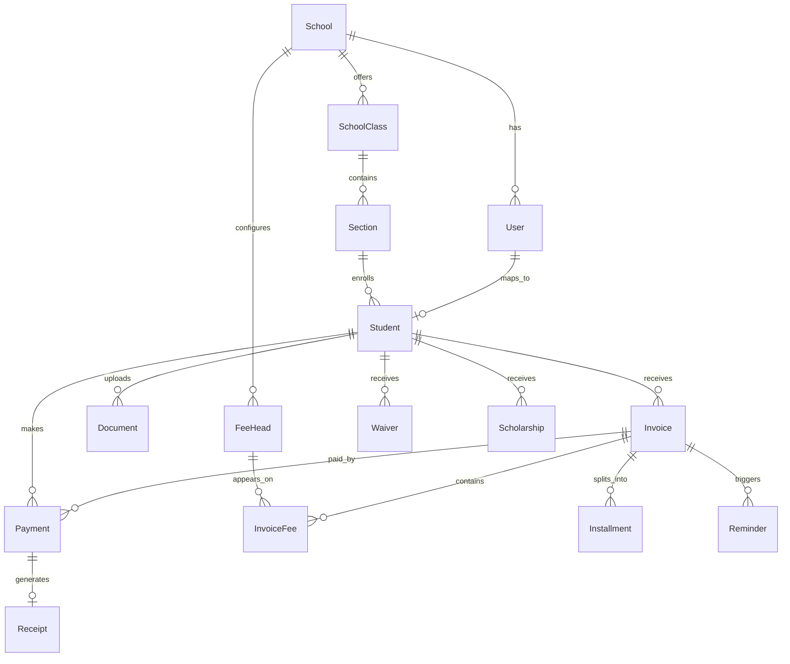

# PaperBuddy ER Diagram

The schema is normalized around school tenancy, role-based users, student profiles, configurable fee heads, invoice line items, installments, multi-mode payments, receipts, waivers, scholarships, reminders, and notifications.
